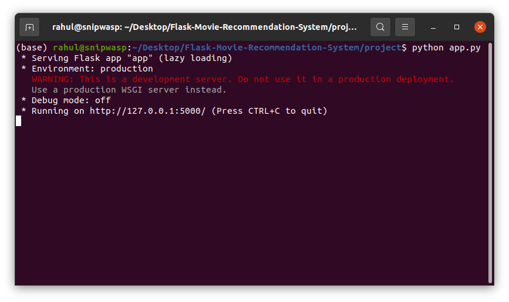

<h1 align="center">Netflix Clone 
  
</h1>

<p align="center">
MOVIE RECOMMENDATION SYSTEM 
</p>
    
<!-- TABLE OF CONTENTS -->
<details open="open">
  <summary>Table of Contents</summary>
  <ol>
    <li>
      <a href="#about-the-project">About The Project</a>
      <ul>
        <li><a href="#salient-features">Salient Features</a></li>
        <li><a href="#compatible-platforms">Compatible Platforms</a></li>
        <li><a href="#built-with">Built With</a></li>
      </ul>
    </li>
    <li>
      <a href="#agile-methodology">Agile Methodology</a>
      <ul>
        <li><a href="#what-is-agile">What is Agile</a></li>
        <li><a href="#how-i-incorporated-agile-methodology-during-the-development-cycle">How I Incorporated Agile Methodology During The Development Cycle</a></li>
      </ul>
    </li>
    <li>
      <a href="#getting-started">Getting Started</a>
      <ul>
        <li><a href="#prerequisites">Prerequisites</a></li>
        <li><a href="#installation">Installation</a></li>
      </ul>
    </li>
    <li><a href="#navigating-through-the-app">Navigating through the App</a></li><ul>
        <li><a href="#login">Login</a></li>
        <li><a href="#chat-window">Chat Window</a></li>
        <li><a href="#video-call">Video Call</a></li>
      </ul>
    <li><a href="#resources-used">Resources Used</a></li>
  </ol>
</details>

<!-- Introduction -->
## Introduction
Over the last two decades, recommender systems have become State-of-the-Art Algorithms and can be regarded as success factors for companies such as Google, Amazon, and Netflix 

The goal of a recommender system is to generate meaningful recommendations to a collection of users for items or products that might interest them. Suggestions for books on Amazon, or movies on Netflix, are real-world examples of the operation of industry-strength recommender systems. The design of such recommendation engines depends on the domain and the particular characteristics of the data available. For example, movie watchers on Netflix frequently provide ratings on a scale of 1 (disliked) to 5 (liked)


<!-- ABOUT THE PROJECT -->

## About The Project

* NETFLIX clone (Movie recommendation) project built during Microsoft Engage 2022 program. 
* It is a movie recommendation system through which we can recommend users video either based on their search or watch history. 

### Salient Features
* Secured using login system
* New Users can login by registering on our website
* Recommend users either based on their search or watch history

### Compatible Platforms
Laptops, Desktops and Tablet PCs

### Built With 
* Python(FLASK Framework)
* HTML
* CSS
* JavaSCript
<!-- INSTALLATIONS -->

## Getting Started
To install and run the project on your local system, following are the requirements:
### Prerequisites
To use this project, follow the steps below:

Initialise git on your terminal.

```bash
git init
```

Clone this repository.

```bash
git clone https://github.com/pooja-gera/MSTeamsClone-Engage2021
``` 

Change the directory. 

```bash
cd Engage-project
```
### Installation

Install required libraries
```sh
  pip install -r requirements.txt
```
Run the following command inorder to change directory in our project
```sh
  cd project
```
Run the following command to run my  project
```sh
  python app.py
```
or
```sh
  flask run
```


<!-- APP TUTORIAL-->
## Navigating Through The App
### Login/Registration Page

New Users can register to my app.
#### Registration Page


Already registered user can login using the credentials
#### Login Page


### Home Page

After logging in, Netflix CLone Home page appears.It is the home of amazing original programming that you can’t find anywhere else. Movies, TV shows, specials and more, it’s all tailored specifically to you.


All the users registered with the app can be added to your chat. Photo sharing, read receipts, formatting the text, and many other things are possible in the chat. The shared photos can be viewed in the right pane. The chat can be deleted by expanding the 'Options' menu in the right pane and clicking the 'Delete' option.


### Video Call

The video call welcome screen shows your video and has a form to enter your name. To place a call, click on 'Copy your ID' and send the random generated unique ID to the person you want to call. 


The person who received the ID needs to copy that in the 'ID to call' input field and click on 'Call' button. You can accept the person's incoming call by clicking on 'Answer' button.


Once the call is accepted, the users are connected and can video call seamlessly with the option to mute audio and video when required. The call can be stopped by clicking on 'Hang Up' button. The video call screen closes and we are navigated back to the chat window.


